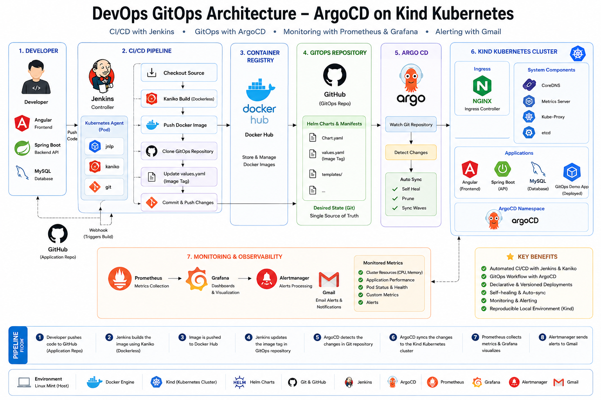
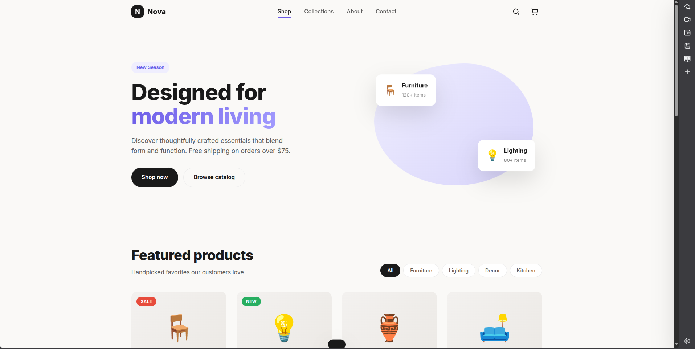
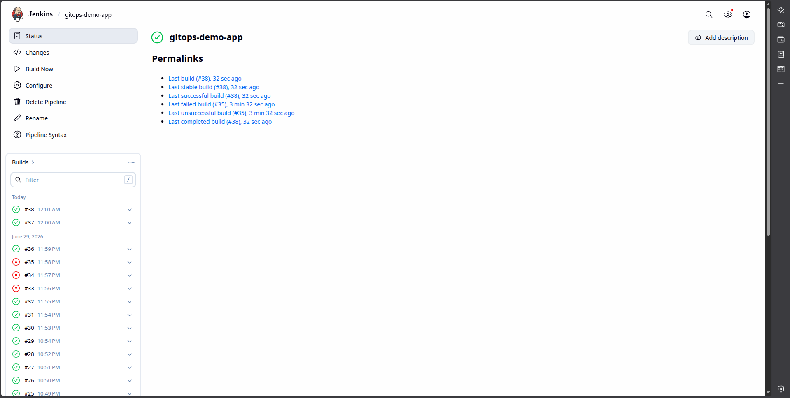
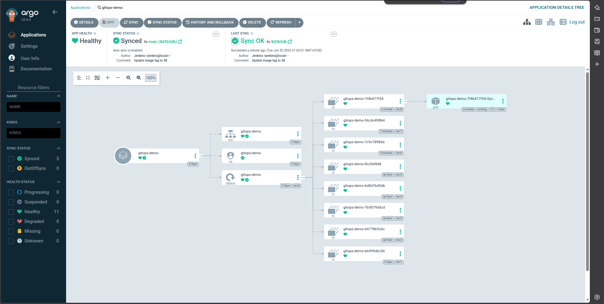
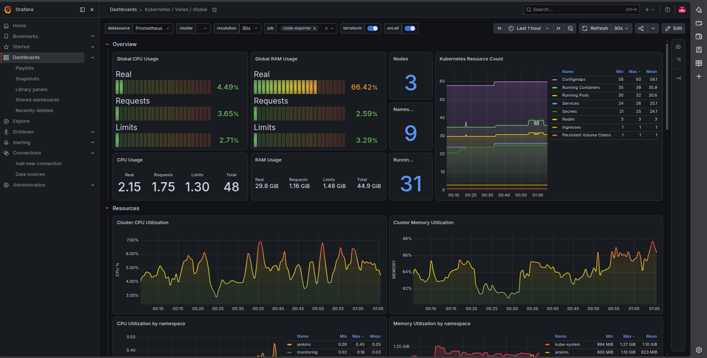
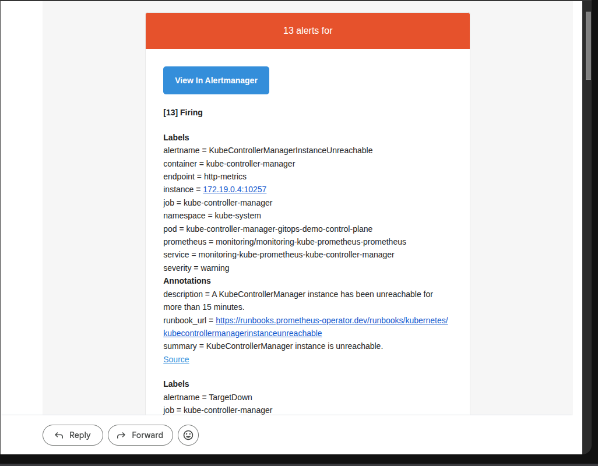
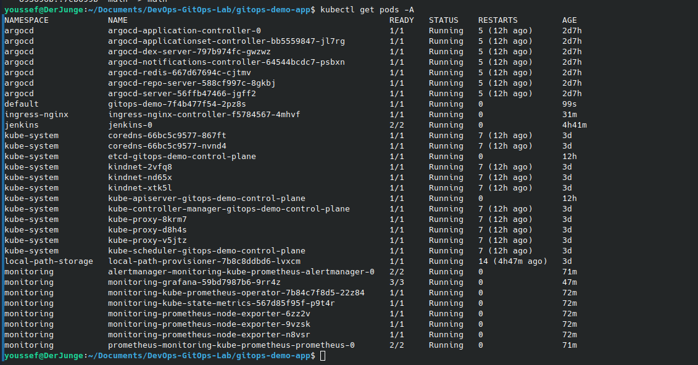

**# 🚀 DevOps GitOps CI/CD Platform on Kubernetes**  
   
**> End-to-End GitOps Platform using **Jenkins, Kaniko, Docker, Helm, ArgoCD, Prometheus, Grafana and Alertmanager** running on a local **Kind Kubernetes Cluster**.**  
   
****  
****  
****  
****  
****  
****  
****  
****  
   
**---**  
   
**# 📖 Overview**  
   
**This project demonstrates a complete **GitOps-based Continuous Deployment platform** built with Kubernetes.**  
   
**Every code change pushed to GitHub automatically triggers a Jenkins CI pipeline that:**  
   
**- Builds a Docker image using **Kaniko****  
**- Pushes the image to **Docker Hub****  
**- Updates the GitOps repository**  
**- Commits the new image tag**  
**- ArgoCD detects the change**  
**- Synchronizes Kubernetes automatically**  
**- Prometheus monitors the cluster**  
**- Grafana visualizes metrics**  
**- Alertmanager sends email notifications through Gmail**  
   
**The project showcases a modern Cloud-Native DevOps workflow without requiring Docker-in-Docker.**  
   
**---**  
   
**# 🏗 Architecture**  
   
**<p align="center">**  
   
****  
   
**</p>**  
   
**---**  
   
**# ⚙ CI/CD & GitOps Workflow**  
   
**```**  
**Developer**  
**     │**  
**     ▼**  
**GitHub (Application Repository)**  
**     │**  
**     ▼**  
**Jenkins Pipeline**  
**     │**  
**     ├── Checkout Source**  
**     ├── Build Docker Image (Kaniko)**  
**     ├── Push Image to Docker Hub**  
**     ├── Clone GitOps Repository**  
**     ├── Update values.yaml**  
**     └── Commit & Push**  
**               │**  
**               ▼**  
**GitOps Repository**  
**               │**  
**               ▼**  
**ArgoCD**  
**               │**  
**               ▼**  
**Kind Kubernetes Cluster**  
**               │**  
**               ▼**  
**Application Updated Automatically**  
**               │**  
**               ▼**  
**Prometheus → Grafana → Alertmanager → Gmail**  
**```**  
   
**---**  
   
**# 🚀 Technologies**  
   
**| Category | Technology |**  
**|------------|----------------|**  
**| CI | Jenkins |**  
**| Image Builder | Kaniko |**  
**| Container Runtime | Docker |**  
**| Registry | Docker Hub |**  
**| GitOps | ArgoCD |**  
**| Orchestration | Kubernetes (Kind) |**  
**| Package Manager | Helm |**  
**| Ingress | NGINX Ingress |**  
**| Monitoring | Prometheus |**  
**| Visualization | Grafana |**  
**| Alerting | Alertmanager |**  
**| Notifications | Gmail SMTP |**  
   
**---**  
   
**# 📸 Project Screenshots**  
   
**## Application**  
   
**<p align="center">**  
   
****  
   
**</p>**  
   
**A modern responsive landing page automatically deployed through the GitOps pipeline.**  
   
**---**  
   
**## Jenkins Pipeline**  
   
**<p align="center">**  
   
****  
   
**</p>**  
   
**Automatic CI pipeline triggered after every GitHub push.**  
   
**Pipeline responsibilities:**  
   
**- Checkout source code**  
**- Build Docker image**  
**- Push image to Docker Hub**  
**- Update GitOps repository**  
**- Commit new image tag**  
   
**---**  
   
**## ArgoCD**  
   
**<p align="center">**  
   
****  
   
**</p>**  
   
**ArgoCD continuously watches the GitOps repository and synchronizes the Kubernetes cluster whenever a new image is available.**  
   
**---**  
   
**## Grafana Monitoring**  
   
**<p align="center">**  
   
****  
   
**</p>**  
   
**Real-time monitoring dashboards displaying:**  
   
**- CPU Usage**  
**- Memory Usage**  
**- Kubernetes Resources**  
**- Cluster Health**  
**- Running Pods**  
**- Namespaces**  
   
**---**  
   
**## Email Alerts**  
   
**<p align="center">**  
   
****  
   
**</p>**  
   
**Alertmanager automatically sends email notifications whenever alerts are triggered inside the Kubernetes cluster.**  
   
**---**  
   
**## Kubernetes Cluster**  
   
**<p align="center">**  
   
****  
   
**</p>**  
   
**Running services include:**  
   
**- Jenkins**  
**- ArgoCD**  
**- Prometheus**  
**- Grafana**  
**- Alertmanager**  
**- NGINX Ingress**  
**- GitOps Demo Application**  
   
**---**  
   
**# 📂 Repository Structure**  
   
**```**  
**gitops-demo-app**  
**│**  
**├── screenshots/**  
**│**  
**├── jenkins/**  
**│     └── kaniko-pod.yaml**  
**│**  
**├── Dockerfile**  
**├── Jenkinsfile**  
**├── index.html**  
**├── styles.css**  
**├── script.js**  
**└── README.md**  
**```**  
   
**---**  
   
**# 🎯 Key Features**  
   
**- Jenkins Kubernetes Agent**  
**- Dockerless image builds using Kaniko**  
**- Docker Hub integration**  
**- GitOps deployment using ArgoCD**  
**- Automatic synchronization**  
**- Helm-managed deployments**  
**- Kubernetes Ingress**  
**- Prometheus monitoring**  
**- Grafana dashboards**  
**- Gmail email alerts**  
**- Fully reproducible local environment**  
   
**---**  
   
**# 🔄 CI/CD Pipeline**  
   
**```**  
**Git Push**  
**    │**  
**    ▼**  
**Jenkins**  
**    │**  
**    ▼**  
**Kaniko Build**  
**    │**  
**    ▼**  
**Docker Hub**  
**    │**  
**    ▼**  
**Update Helm values.yaml**  
**    │**  
**    ▼**  
**GitOps Repository**  
**    │**  
**    ▼**  
**ArgoCD Sync**  
**    │**  
**    ▼**  
**Kubernetes Deployment**  
**```**  
   
**---**  
   
**# 📊 Monitoring & Alerting**  
   
**The platform provides complete observability.**  
   
**### Prometheus**  
   
**- Metrics Collection**  
   
**### Grafana**  
   
**- Dashboards**  
**- Visualization**  
   
**### Alertmanager**  
   
**- Alert Processing**  
   
**### Gmail**  
   
**- Email Notifications**  
   
**---**  
   
**# 🚀 Future Improvements**  
   
**This project currently deploys a static web application.**  
   
**Planned enhancements include:**  
   
**- Angular Frontend**  
**- Spring Boot REST API**  
**- MySQL Database**  
**- HTTPS (Let's Encrypt)**  
**- SonarQube**  
**- Trivy Security Scanning**  
**- Terraform Infrastructure**  
**- AWS Deployment**  
**- Multi-Environment GitOps**  
**- GitHub Actions**  
   
**---**  
   
**# 📚 What I Learned**  
   
**Through this project I gained hands-on experience with:**  
   
**- Kubernetes**  
**- Helm**  
**- Jenkins**  
**- Kaniko**  
**- Docker**  
**- ArgoCD**  
**- GitOps**  
**- Docker Hub**  
**- Prometheus**  
**- Grafana**  
**- Alertmanager**  
**- Kubernetes Monitoring**  
**- Email Alerting**  
**- CI/CD Automation**  
   
**---**  
   
**# 👨‍💻 Author**  
   
****Youssef Abidi****  
   
**Cloud Engineering Student**  
   
**ESPRIT Engineering School**  
   
**GitHub:**  
   
**https://github.com/YoussefAbidi69**  
   
**---**  
   
**## ⭐ If you found this project interesting, consider giving it a star!**  
